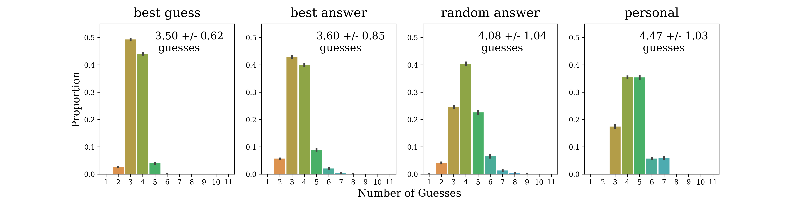

## Wordle Solver

This codebase helps you make intelligent guesses when playing wordle, using ideas from information theory! 

### Installation

Clone this repository and run `conda env create -f env.yml` to create the conda environment. Then run `conda activate wordle`. 

### User Guide

The main program in this codebase is `wordle_solver.py`. This program helps you make intelligent guesses,
and comes with the followig arguments. 

- `--board`: this argument allows you to enter the current state of your game as a sequence of guesses and outputs. The default sequence is empty, assuming you're starting without a guess, but it can be as many pairs of guesses and outputs you've already played. To enter an output, please use the following convention: 

  🟩 = `"G"`, 🟨 = `"Y"`, and ⬜ = `"X"`. 

  For example, if you guessed "crane" and saw ⬜ ⬜ 🟩 ⬜ 🟩, and then "cloud" and saw ⬜ 🟩 ⬜ ⬜ 🟨, you'd enter `--board "crane" "XXGXG" "cloud" "XGXXY"`. 

- `--data_dir`: this argument specifies the location of `wordle_words.txt` a list of valid wordle words. The default directory is `data`. This directory will also store `starting_guesses.csv`, an precomputed list of guesses ranked by their expected information.

This program will provide next guess suggestions from two strategies: `best_guess` and `best_answer`. `best_guess` suggests the word with the highest expected information, while `best_answer` suggests the word with the highest expected information that is also a potential answer. In general, `best_guess` is a more cautious strategy that focuses on narrowing down possibilities at the expense of quick wins, while `best_answer` trades some informational gain for the chance to get a lucky match. The performance of these two strategies is evaluated using `strategy_simulator.py`. For more details, please see the `design_document.pdf`. 

### Examples

Let's say that you guessed "crane" and saw the sequence 🟩 🟨 ⬜ ⬜ ⬜. 

To find the next guess, you could enter in the command `python wordle_solver --board "crane" "GYXXX"`, which would produce the following output. 

```
There are 9 possible answers remaining. 

All Guesses Ranked by Information (* = possible answer)
ivory 3.170  tulip 2.948  sorry 2.948  slurp 2.948  court 2.948 *
viola 3.170  guile 2.948  quirk 2.948  folio 2.948  hovel 2.948  
lorry 3.170  could 2.948  intro 2.948  rumor 2.948  furor 2.948  
glory 3.170  quail 2.948  worry 2.948  ovoid 2.948  fluid 2.948  
... top 20/2315 shown 

Possible Answers Ranked by Information
court 2.948  choir 2.642  curly 2.419  chirp 2.419  curvy 2.059
chord 2.725  curry 2.503  curio 2.419  color 2.419
... top 9/9 shown 

Using the strategy: best_guess, we suggest picking one of: 
ivory  viola  lorry  glory


Using the strategy: best_answer, we suggest picking one of: 
court
```

### Performance

We can benchmark our performance using `strategy_simulations.py`. Both of our strategy variants can reliably solve wordles within 3-4 guesses, beating out my personal performance and reference baselines. For more details, please see the `design_document.pdf`. 


